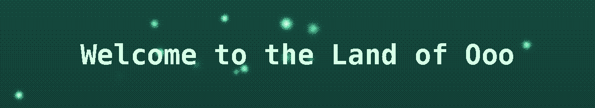

 

  
   
  <i>"Time is an illusion that helps things make sense." — BMO</i>

 

  

## 🗺️ Quests I've Embarked On (Projects)

 

 

## 📅 The Enchiridion (Contribution Calendar)

  

 

## 📊 Stats from the Tree Fort

 

### 🛠️ Tools in My Backpack

  

 

  

